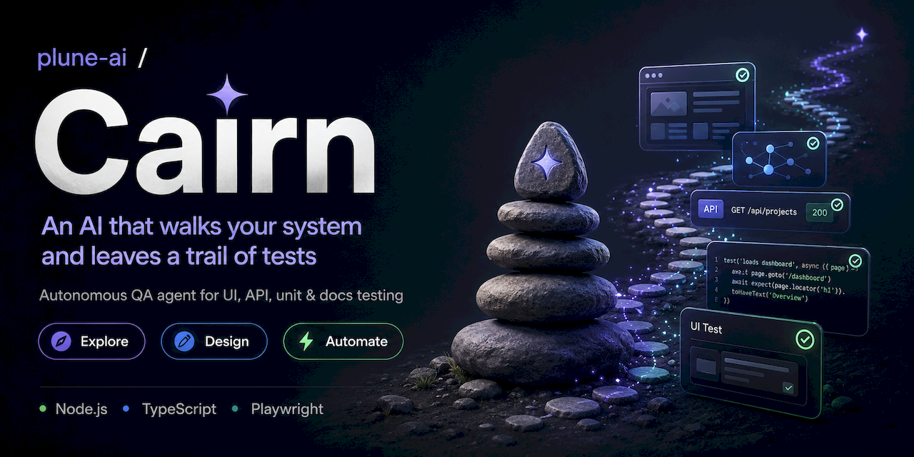

<p align="center">
  
</p>

# Cairn

> **Cairn — an AI that walks your system and leaves a trail of tests: UI, API, unit, docs.**

[](https://github.com/plune-ai/cairn/actions/workflows/ci.yml)
[](https://www.npmjs.com/package/@plune-ai/cairn)
[](package.json)
[](LICENSE)

▶ **Demo:** [`docs/demo/cairn.cast`](docs/demo/cairn.cast) — play with `asciinema play docs/demo/cairn.cast`

Autonomous QA agent (Node.js / TypeScript) that logs into a web app with a saved session, explores
pages (ARIA snapshot + screenshot), designs methodology-based UI test cases (ISO/IEC/IEEE 29119-4),
generates runnable `@playwright/test` code, self-validates, self-repairs, and **self-improves** via
Langfuse. A portable CLI + library for embedding into other TypeScript projects.

**Cairn is the generation layer** — it produces tests across surfaces (UI + API shipped; unit / docs
planned), each arriving by demand. A separate **Plune** layer owns record / management / eval.

> **Renamed Lex-Bot → Cairn.** The old `lex-bot` command and `@plune-ai/lex-bot` package still work
> (the CLI prints a one-line deprecation notice) — prefer `cairn` / `@plune-ai/cairn`. Legacy
> `LEX_`/`LEXBOT_` env vars still work too; prefer `CAIRN_`.

## What it does

Point it at a URL (behind login, with a saved Playwright `storageState`) and it will **observe** (ARIA
+ screenshot + interactive elements), **ground** (verify every locator, explore tabs/views, probe safe
state transitions — so it tests what is *actually* there, not hallucinations), **design** 29119-4 cases
(EP / BVA / decision-table / state-transition / error-guessing), **generate & validate** POM-style
`@playwright/test` specs with **self-repair** (keep-best: a repair never makes the suite worse), and
**judge & learn** (deterministic scorers + an LLM judge + a holistic **Pilot** verdict, traced to Langfuse).

It writes two kinds of case: **ATC** (*Automatable* — code is generated) and **MTC** (*Manual* — full
submits, security/XSS, visual/UX, irreversible actions — left for a human).

## Two decoupled modes

- **`design`** — explore + write cases as Markdown (`ATC-*` / `MTC-*`) with recorded selectors. **No code.**
- **`automate`** — generate `@playwright/test` code from approved `ATC-*` cases (skips `MTC-*`).
- **`explore`** — the full pipeline at once (cases → code → validation → repair → Pilot verdict).

Full walkthrough: **[Getting started](docs/getting-started.md)**.

## Install

```bash
npm install -g @plune-ai/cairn      # global CLI → run `cairn …`
# …or local / library:  npm install @plune-ai/cairn   → run via `npx cairn …`

cairn install-browsers              # one-time: the Chromium Cairn drives (its OWN Playwright revision)
```

Requires Node.js 20+. Copy `.env.example` → `.env` and add your keys. Browsers are a **separate
download** — run `cairn install-browsers` once, or pass `--channel chrome` to drive your installed
Chrome with **zero download** (also the simplest path for OAuth and for projects that already ship
Playwright). `cairn doctor` diagnoses the setup. See **[Authenticated targets](docs/sessions.md)** and
**[Configuration](docs/configuration.md)**.

## Quickstart

> Installed locally (without `-g`)? Prefix every `cairn …` below with `npx`.

```bash
# 1. Capture a login session once (a browser opens — log in, then press Enter)
cairn session capture --url https://app.example.com/login --name myapp

# 2. Design test cases (no code) — review the .md files it writes
cairn design --url https://app.example.com/page --session myapp --checklist plan.md

# 3. Automate the approved (ATC) cases → @playwright/test code, and run them
cairn automate --run runs/<id> --validate --session myapp

# …or do everything at once:
cairn explore --url https://app.example.com/page --session myapp --checklist plan.md
```

`--checklist` steers **what** the bot tests (and is scored as coverage) — copy
[`examples/plan.md`](examples/plan.md) as a starting point. Add `--fresh` to ignore prior runs of a URL,
`--style <pack>` to restyle cases ([Prompts & styles](docs/prompts-and-styles.md)), or `--critique` to
prune weak cases and top up technique gaps. (Git Bash: quote `--run 'runs/<id>'` or use the bare id.)

Add `--screencast` (to `explore`, or `automate --validate`) to record a **`.webm` per scenario** during
validation into `runs/<id>/screencasts/`, with a `screencasts.json` sidecar mapping each scenario's step
chapters (step → timecode). It's a review-gate affordance — watch what the agent did before approving a
case. Off by default; the recorded `.webm` paths are linked from the run summary and the TUI result screen.

## Interactive TUI

Run `cairn` with **no arguments** in a terminal for a guided UI (launcher → form → live dashboard →
result summary → past-run browser). Ink/React are optional deps — see **[docs/tui.md](docs/tui.md)**.

## Commands

| Command | Purpose |
|---|---|
| `cairn session capture --url <loginUrl> --name <s>` | Capture a login session → `.auth/` (`cairn login` is a shorthand; `session ls` / `rm`) |
| `cairn observe --url <u> [--session <s>]` | ARIA snapshot + interactive elements + screenshot |
| `cairn design --url <u> --session <s> [--checklist <f>] [--style <s>] [--fresh] [--critique]` | Test cases only (ATC/MTC `.md` + selectors), no code |
| `cairn automate --run <dir> [--validate --session <s>] [--screencast]` | `@playwright/test` from `ATC-*` cases |
| `cairn promote --run <dir> --cases <ids> [--session <s>]` | Promote manual MTC case(s) to ATC (.md only; then `automate`) |
| `cairn explore --url <u> --session <s> [--checklist <f>] [--fresh] [--critique] [--screencast]` | Full pipeline (cases → code → validate → repair → Pilot) |
| `cairn api --spec <path\|url> [--base-url <u>] [--negative] [--scenarios] [--adversarial [styles]]` | Generate (and, with `--base-url`, run + assert status/contract) happy-path, negative-schema, multi-endpoint-scenario, and adversarial (`normal`/`curious`/`psycho`/`hacker`) cases from an OpenAPI 3.x spec |
| `cairn experiment --dataset <d> --candidate name=file` | Compare prompt versions on a dataset |

> `lex-bot <command>` still runs every command above (deprecated alias — prints a notice, then runs `cairn`).

## Library API

```ts
import { runDesign, runAutomate, runExploration, loadConfig } from "@plune-ai/cairn";

const config = loadConfig(process.env);
const result = await runDesign({ url, config, sessionName: "myapp", checklistText });
// result.testCases, result.testCaseFiles, result.scores
```

## Documentation

- **[Getting started](docs/getting-started.md)** — step-by-step onboarding (session → design → review → promote → automate → validate).
- **[Authenticated targets](docs/sessions.md)** · **[Configuration & role routing](docs/configuration.md)** · **[Prompts & styles](docs/prompts-and-styles.md)** · **[Interactive TUI](docs/tui.md)** · **[MCP server](docs/mcp.md)**
- **[Metrics](docs/metrics.md)** · **[Cost benchmark](docs/cost.md)** · **[Langfuse](docs/langfuse.md)**
- **[Architecture overview](docs/architecture/overview.md)** — the plain async pipeline, locator grounding, self-improvement.
- **[Architecture Decision Records](docs/adr/)** — why it's built this way (0001–0013).

## Development

```bash
npm run build        # tsc
npm test             # vitest (unit + integration; LLM/browser are mocked in unit)
npm run test:coverage
npm run lint
```

## License

Apache-2.0 (relicensed from GPL-3.0 in 0.3.0 — see [`docs/adr/0012`](docs/adr/0012-relicense-to-apache-2.0.md)). Methodology prompts ported from `AZANIR/qa-skills` (see [`docs/adr/0008`](docs/adr/0008-methodology-port-from-qa-skills.md)).
